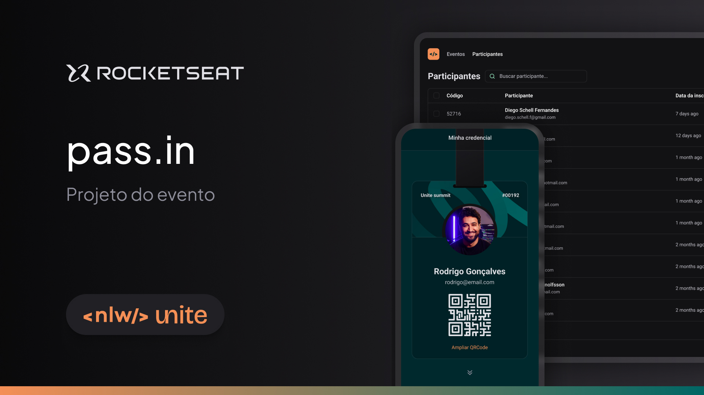

<h1 align="center">Pass.in<h1>

Projeto desenvolvido na NLW Unite da Rocketseat.  

  

  <a href="#-tecnologias">Tecnologias</a>&nbsp;&nbsp;&nbsp;|&nbsp;&nbsp;&nbsp;
  <a href="#-projeto">Projeto</a>&nbsp;&nbsp;&nbsp;|&nbsp;&nbsp;&nbsp;
  <a href="#-layout">Layout</a>&nbsp;&nbsp;&nbsp;

  

## 🚀 Tecnologias 

- HTML e CSS
- JavaScript
- Figma
- Git e Github

## 👨‍💻 Projeto 

[📌 Clique aqui para acessar](https://murilopizolito.github.io/NLW-Unite/)

## 🔖 Layout

Você pode visualizar o layout do projeto através [DESSE LINK](https://www.figma.com/community/file/1356738933008624188). É necessário ter conta no [Figma](https://figma.com) para acessá-lo.